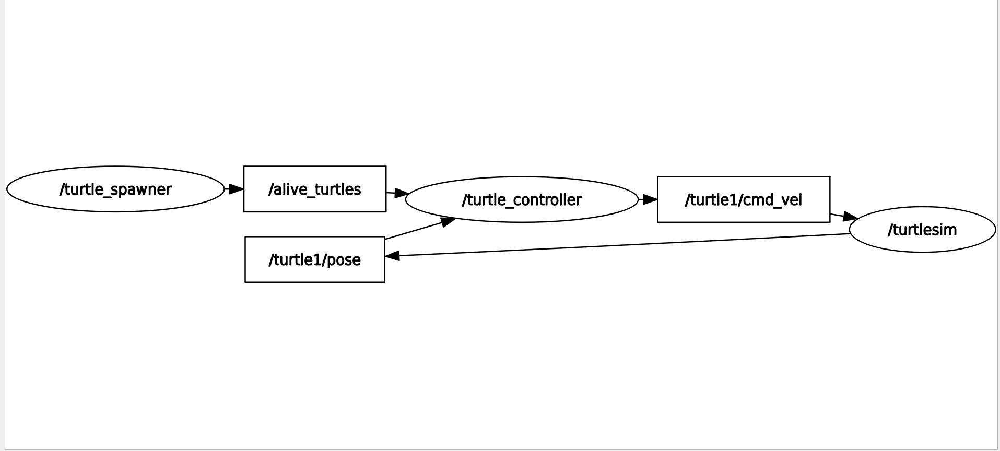

# Turtlesim - Catch Them All

A ROS 2 project where you control a turtle in the classic `turtlesim` simulator to catch all spawned turtles! This project demonstrates ROS 2 concepts such as custom messages, services, parameters, and multi-node orchestration.



[▶️ Watch Demo Video](project_demo.webm)

## Table of Contents
- [Overview](#overview)
- [Quick Start](#quick-start)
- [Features](#features)
- [Project Structure](#project-structure)
- [Parameters and Configuration](#parameters-and-configuration)
- [Packages and Nodes](#packages-and-nodes)
- [Custom Interfaces](#custom-interfaces)
- [Usage Examples](#usage-examples)
- [Testing](#testing)
- [Troubleshooting](#troubleshooting)
- [Contributing](#contributing)
- [License](#license)

## Overview
This project features a fully automated turtle controller that navigates the `turtlesim` world to catch all spawned turtles, showcasing essential ROS 2 skills: node orchestration, custom interfaces, parameterization, and launch management.

**Why this project matters:**
This project helped me understand ROS2 node communication, services, and interface design. It also mimics real-world task assignment in multi-agent systems.

## Quick Start
1. **Install ROS 2 (Humble or later)**
2. **Clone this repository:**
   ```sh
   git clone https://github.com/spandan11106/Turtlesim---Catch-them-all.git
   cd Turtlesim---Catch-them-all
   ```
3. **Build the workspace:**
   ```sh
   colcon build
   source install/setup.bash
   ```
4. **Launch the project:**
   ```sh
   ros2 launch bringup turtlesim_launch.xml
   ```

## Features
- **Automatic Turtle Catching:** The main controller node automatically finds and catches all turtles in the simulation.
- **Custom Interfaces:** Defines custom messages and services for turtle management.
- **Bringup Launch:** Easily launch the full system with one command.
- **Parameterization:** Choose to catch the closest turtle first or in spawn order.
- **Testing:** Includes basic Python tests and ROS 2 linting.

## Project Structure
```text
Turtlesim---Catch-them-all/
├── src/
│   ├── bringup/         # Launch and config files
│   ├── catch_them_all/  # Main logic and nodes
│   └── interfaces/      # Custom messages and services
├── build/               # Ignored: build artifacts
├── install/             # Ignored: install artifacts
├── log/                 # Ignored: logs
├── README.md
└── .gitignore
```

## Parameters and Configuration
Parameters are managed via a YAML file (`src/bringup/config/parameters.yaml`). You can modify these to change the turtle-catching behavior without editing the code.

Example:
```yaml
/turtle_controller:
  ros__parameters:
    catch_closest_turtle_first: False # Catch turtles in spawn order
/turtle_spawner:
  ros__parameters:
    turtle_name_prefix: "demo"
    spawn_frequency: 2.0
```
- `catch_closest_turtle_first`: If `True`, targets the nearest turtle; if `False`, follows spawn order.
- `turtle_name_prefix`: Prefix for naming spawned turtles.
- `spawn_frequency`: Frequency (in seconds) for spawning new turtles.

## Packages and Nodes
- **catch_them_all**
  - `turtle_controller.py`: Controls the main turtle, subscribes to alive turtles, and sends velocity commands to catch them.
  - `turtle_spawner.py`: Spawns new turtles and manages their lifecycle.
- **interfaces**
  - Custom messages and services (see below).
- **bringup**
  - Launch files and YAML configuration for starting the whole system.

## Custom Interfaces
- **Messages:**
  - `Turtle.msg`: Contains information about a turtle (e.g., name, position, orientation).
  - `TurtleArray.msg`: An array of `Turtle` messages for tracking multiple turtles.
- **Services:**
  - `CatchTurtle.srv`: Service to command the controller to catch a specific turtle.

These interfaces allow nodes to communicate complex data structures and requests in a type-safe manner.

## Usage Examples
### Basic ROS 2 Commands
- **List running nodes:**
  ```sh
  ros2 node list
  ```
- **Check parameters:**
  ```sh
  ros2 param list
  ros2 param get /turtle_controller catch_closest_turtle_first
  ```
- **Call the catch service:**
  ```sh
  ros2 service call /catch_turtle interfaces/srv/CatchTurtle "{name: 'turtle2'}"
  ```

### Change Parameters in YAML
Edit `src/bringup/config/parameters.yaml` as shown above to change project behavior.

## Testing
Run the included tests and linting with:
```sh
colcon test
colcon test-result --all
```
Ensure all dependencies for testing are installed.

## Troubleshooting
- **Build errors:** Make sure you have sourced the correct ROS 2 setup script and installed all dependencies.
- **No turtles are being caught:** Check your parameters in the YAML file and ensure the nodes are running.
- **Nodes not found:** Use `ros2 node list` to see which nodes are active.
- **Still stuck?** Open an issue on GitHub with your error message and setup details.

## Contributing
Pull requests and issues are welcome! Please open an issue or submit a PR for improvements or bug fixes.

---
Created by Spandan Mhapsekar
